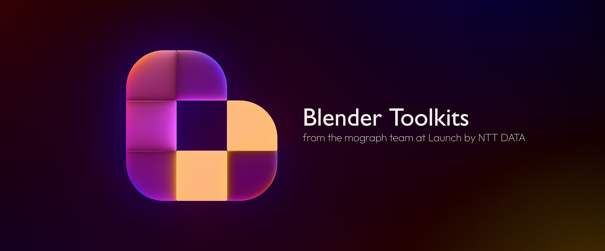
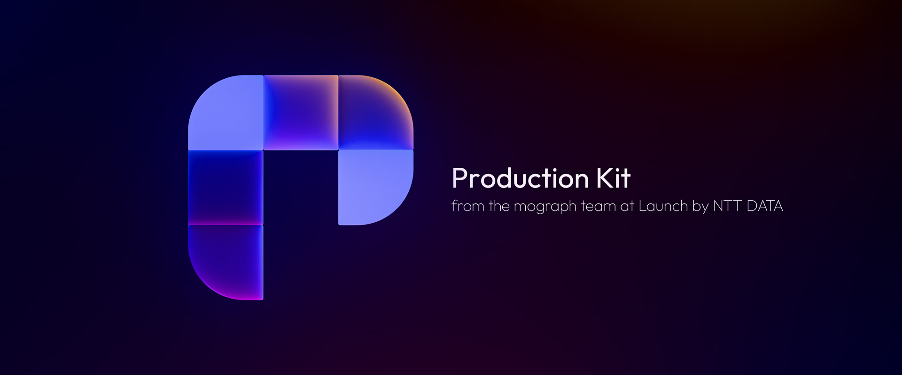
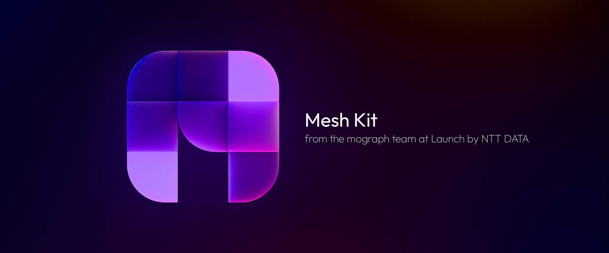
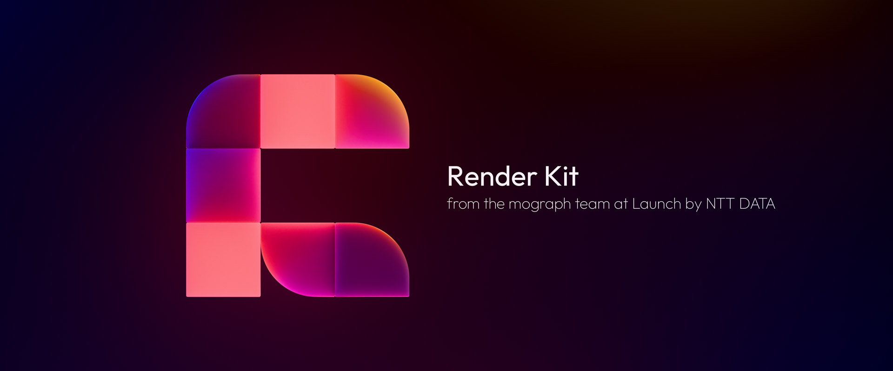
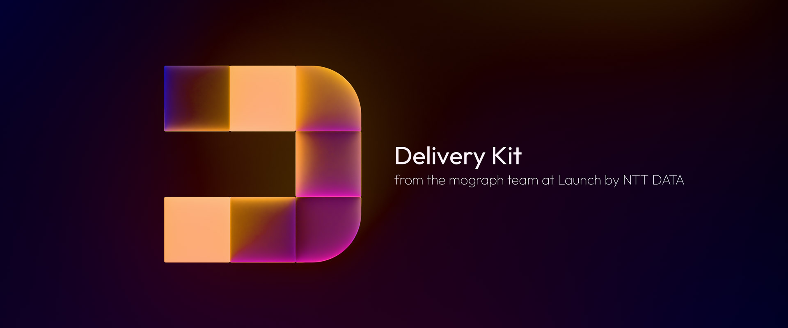

# Launch Blender Extensions

Centralised hub for the Launch suite of Blender toolkits.

## Installation via Extensions Platform:

- Go to Blender Preferences > Get Extensions > Repositories > **＋** > Add Remote Repository
- Set the URL to `https://jeinselen.github.io/Launch-Blender-Extensions/index.json`
- Set the local directory if desired (relative paths seem to fail, try absolute instead)
- Enable `Check for Updates on Start`
- Filter the available extensions for "Launch" and install as needed

## Installation via Download:

- Download the .zip file for a specific kit
- Drag-and-drop the file into Blender

This method will not connect to the centralised repository here on GitHub and updates will not be automatically available. If you don't need easy updates, don't want GitHub servers to be pinged when you start up Blender, or would just like to try some extensions without adding yet another repository to your Blender settings, this is the option for you.

## Available Toolkits:

### Launch Production Kit — General Utilities

Extension documentation and bug reports — https://github.com/jeinselen/Blender-ProductionKit

- Audio Waveforms
  - Renders audio clips from the Sequencer as waveforms in the general Timeline view
- Color Palette
  - Creates a color palette in the 3D Viewport sidebar using plain text storage for easy transport
- Driver Functions
  - Adds custom value drivers and a GUI for setting them up, including timeline values based on markers, random, wiggle, and curve-at-time functions
- Project Versioning
  - Quick shortcuts for saving numbered project files in an archive location
- Update Images
  - Update all images from the node editor sidebar, automatically change settings based on file name patterns, and change file sources with text based find and replace
- Vertex Location Keyframes
  - Adds keyframes to objects using the vertex positions from a selected mesh
- Viewport Shading
  - Adds viewport shading options to the View menu along with number pad shortcuts

### Launch Mesh Kit — Geometry Editing

Extension documentation and bug reports — https://github.com/jeinselen/Blender-MeshKit

- Copy Paste
  - Stores geometry in a project-specific clipboard for easy copy/paste between mesh or curve objects
- Planar UV
  - Projects UV coordinates from a specified axis using numerical scale inputs for repeatability
- Point Array
  - Generates vertex point arrays in various patterns, including cubic grid, golden spiral, poisson packing, and volume field data
- Radial Offset
  - Offsets vertices using radial coordinates, useful for increasing radial scales by a specified distance
- Segment Mesh
  - Breaks up large contiguous meshes into chunks, useful for partitioning maps for use in game engines
- Vertex Quantize
  - Snaps vertices to customisable XYZ steps

### Launch Render Kit — Rendering Management

Extension documentation and bug reports — https://github.com/jeinselen/Blender-RenderKit

- Render Variables
  - Adds dynamic variables to rendering output paths, including:
    - The name of the current project, scene, view layer, collection, camera, selected item, material, node, socket (for node rendering only), or closest timeline marker
    - The selected render engine, device, samples, features, and rendering duration (in total seconds or HH:MM:SS formats)
    - The current computer host, processor, platform, system type, OS version, Python version, and Blender version
    - Date, time, global serial number, current frame, and batch rendering index (see below batch feature)
    - Custom scene, render layer, and object data values that can be set using drivers or animation data
- Autosave Images
  - Automatically saves every render in a specified folder using custom name and formatting
- Autosave Videos
  - Automatically processes image sequences using FFmpeg after rendering completes
- Batch Rendering
  - One-click rendering of collections, items, cameras, or texture folders to individual images or sequences
- Render Nodes
  - One-click baking of material nodes to texture files
- Render Proxy
  - Shortcut for triggering a proxy render with resolution and engine settings
- Render Region
  - Adds numerical inputs for the render region feature
- Render Data
  - Tracks the total time spent rendering a project and displays estimated time remaining during animation sequence rendering
- Render Notifications
  - Sends an email, push notification, or announces render statistics at the completion of renders over a given time limit

### Launch Delivery Kit — Quick Exports

Extension documentation and bug reports — https://github.com/jeinselen/Blender-DeliveryKit

- Unity 3D (FBX)
- Unreal Engine (FBX)
- ThreeJS (GLB)
- Element3D (OBJ)
- Xcode (USDZ)
- 3D Printing (STL)
- Unity 3D Volume Field (VF)
- 3D Texture Strip (EXR)
- Item Position (CSV)
- Item Vertices (CSV)

These extensions are a direct continuation of the original VF Tools add-ons by Vectorform for Blender 2.8 through 4.1, and maintain the original GPL licensing.

Software is provided as-is with no warranty or provision of suitability. These are internal tools and are shared because we want to support an open community. Bug reports are welcomed (please use the specific extension repository, not this centralised hub), but we cannot commit to fixing or adding features. Not all features may be actively maintained, as they're updated on an as-needed basis.
